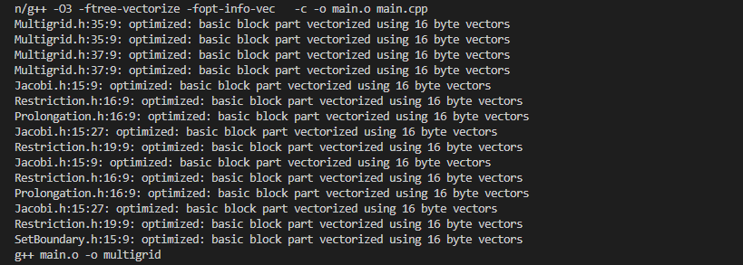
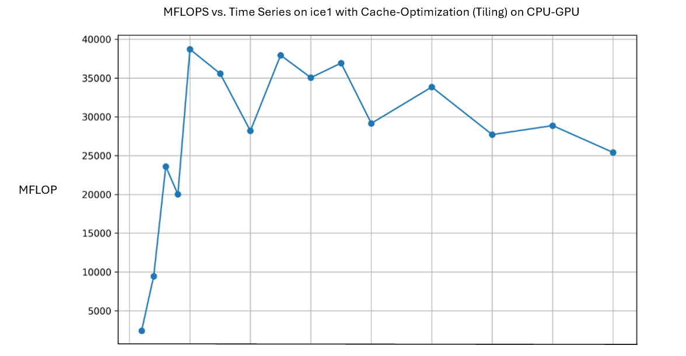

# Evaulation_of_HPC_Systems_and_Accelerators-TUM-LMU-LRZ-
Experimental evaluation of HPC Systems and Accelerators on Intel Ice, Thunder, Fujitsu, etc. The course done jointly by TUM, LMU and LRZ.

# Project02 - Jacobi Smoother + Multigrid Scheme 
Group: 101
# ARCHITETURE: ICELAKE 

### 2a) Preparation for Profiling:
To optimize the given code by not inlining some functions, we can use the 'noinline' attribute for functions like `solve` in the Multigrid class. The modification for GNU compiler is given in the code snippet below:

```cpp
[[gnu::noinline]] FLOAT *solve(
      const unsigned int preSmoothing, const unsigned int postSmoothing,
      const unsigned int jacobiStepsCoarsestLevel,
      FLOAT *const fineGridValues1, FLOAT *const fineGridValues2,
      const FLOAT *const fineGridRhs)
```
By including `-pg` in the compiler flags, we can use `gprof` to observe the time spent on functions. After using `[[gnu::noinline]]` in the Multigrid class, the time spent code shown below gives time spent on the different coarseness levels of the multigrid scheme. As `gprof` did not give detailed profiling results, I used `perf` to indentify the bottlenecks.


```cpp
startTime = std::chrono::high_resolution_clock::now();

      for (unsigned int i = 0; i < jacobiStepsCoarsestLevel; i++)
      {
        _jacobi.iterate(readField, writeField, fineGridRhs);
        FLOAT *swap = readField;
        readField = writeField;
        writeField = swap;
      }

      // Stop timer and print elapsed time
      endTime = std::chrono::high_resolution_clock::now();
      auto duration = std::chrono::duration_cast<std::chrono::microseconds>(endTime - startTime);
      std::cout << "Coarsest Level Jacobi Time: " << duration.count() << " microseconds" << std::endl;

```
After using `-fno-inline` compiler flag as well, there is an improvement in the overall runtime by a factor of `1.25` times. 
To include a template parameter for coarseness level, the following modification is implemented:
```cpp
template <unsigned int PreSmoothing, unsigned int PostSmoothing, unsigned int JacobiStepsCoarsestLevel>
  FLOAT *solve(
      FLOAT *const fineGridValues1, FLOAT *const fineGridValues2,
      const FLOAT *const fineGridRhs)
  {//
```


### 2b) Parellelization
From the profiler results above, the method `iterate` from "Jacobi" class creates maximum overhead. However, functions from `Prolongation` and `ComputeError` classes can also be a target for OpenMP parallelization. The main focus of for-loop parallelization with OpenMP is given below:

```cpp
    unsigned int pos = 0;
    for (unsigned int y = 1; y < _ny + 1; y++)
    {
      for (unsigned int x = 1; x < _nx + 1; x++)
      {
        // do Jacobi update and write to writePtr
        writePtr[pos] = _RHS * rhsPtr[pos];
        writePtr[pos] += _X * (readPtr_W[pos] + readPtr_E[pos]);
        writePtr[pos] += _Y * (readPtr_S[pos] + readPtr_N[pos]);

        // update pos along x-axis
        pos++;
      }

      // update pos along y-axis; therefore just jump over the two boundary values
      pos += 2;
    }
  }
```

The OpenMP offloaded code snippet is given below:
```cpp
 unsigned int pos = 0;

    #pragma omp parallel for shared(readPtr_S, readPtr_W, readPtr_E, readPtr_N, rhsPtr, writePtr) \
                             default(none) private(pos) schedule(static)
    for (unsigned int y = 1; y < _ny + 1; y++)
    {
        for (unsigned int x = 1; x < _nx + 1; x++)
        {
            // do Jacobi update and write to writePtr
            writePtr[pos] = _RHS * rhsPtr[pos];
            writePtr[pos] += _X * (readPtr_W[pos] + readPtr_E[pos]);
            writePtr[pos] += _Y * (readPtr_S[pos] + readPtr_N[pos]);
```

 
### 2c) The following command gives profiled results for cache hits and misses.

```bash
perf stat -e instructions,L1-dcache-stores,L1-dcache-loads,L1-dcache-load-misses ./multigrid 4 6 14 8
```

```txt
Performance counter stats for './multigrid 4 6 14 8':


 3,511,494,251,980      instructions
   481,815,595,905      L1-dcache-stores
 1,253,466,773,637      L1-dcache-loads
    98,462,757,409      L1-dcache-load-misses     #    7.86% of all L1-dcache hits
```

To reuse data from cache by performing multiple passes on Jacobi interweaved in one sweep over the data, the main loop is modified as shown below. This would allow data to remain in cache and reused for subsequent iterations, improving cache efficiency and memory access overhead. The main loop iterates for 'multigridCycles' times, consisting of multiple Jacobi passes. After each set of Jacobi passes, the fields 'field1' and 'field2' are swapped to ensure correct data exchange between iterations. The code snippet shown below shows the approach used to maximize cache reuse and optimize memory access patterns for improved performance.

```cpp
for (unsigned int i = 0; i < multigridCycles; i++)
  {
    for (unsigned int j = 0; j < 5; j++)
    {
      currentSolution = multigrid.solve(
          preSmoothing, postSmoothing, jacobiStepsCoarsestLevel,
          field1, field2, rhs);
      std::swap(field1, field2); // Swapping fields for next iteration
    }

    computeError.computePointwiseError(currentSolution);
    // ...
```

```txt
 Performance counter stats for './multigrid 4 6 14 8':

   728,346,793,210      instructions
    98,128,621,537      L1-dcache-stores
   254,199,029,271      L1-dcache-loads
    20,395,823,615      L1-dcache-load-misses     #    8.02% of all L1-dcache hits

     107.705541569 seconds time elapsed

     106.269828000 seconds user
       1.431970000 seconds sys  
```
This reduces the L1 cache misses by a large factor. This can further be improved by offloading the loop just introduced via OpenMP as shown below:

```cpp
for (unsigned int i = 0; i < multigridCycles; i++)
  {
    // Perform multiple Jacobi passes interweaved in one sweep over the data in parallel
    #pragma omp parallel for
    for (unsigned int j = 0; j < 5; j++)
    {
      currentSolution = multigrid.solve(
          preSmoothing, postSmoothing, jacobiStepsCoarsestLevel,
          field1, field2, rhs);
          //...
```


### 3) CPU Optimization

Just inspecting the assembly code shows that the Jacobi Solver was not auto-vectorized. Just by adding two flags `-ftree-vectorize` and `fopt-info-vec`, we observe the following results on the console:



This indicate that Jacobi, Prolongation, Multigrid, etc. were vectorized as a part of optimization. The output stream `basic block part ...` indicates that a block i.e. a sequence of instructions with a single entry point and a single exit point, was vectorized using 16-byte vectors. The auto-vectorization also indicates that SIMD instructions are being utilized for vectorization. This would result in improved performance on Icelake architectures, which supports SIMD instructions.

To use SIMD intrinsics, we can either modify Jacobi.h
The code snippet below shows the SIMD version of the `Jacobi` class:

```cpp
class Jacobi
{
public:
    Jacobi(const unsigned int nx, const unsigned int ny)
        : _nx(nx), _ny(ny), _X(getX(nx, ny)), _Y(getY(nx, ny)), _RHS(getRHS(nx, ny)) {}
    ~Jacobi() {}

    void iterate(const FLOAT* const readField, FLOAT* const writeField, const FLOAT* const rhs) const
    {
        // Use SIMD for vectorized computation
        const __m128 X = _mm_set1_ps(_X);
        const __m128 Y = _mm_set1_ps(_Y);
        const __m128 RHS = _mm_set1_ps(_RHS);

        for (unsigned int y = 1; y < _ny + 1; y++)
        {
            for (unsigned int x = 1; x < _nx + 1; x += 4) // Processing 4 elements at a time with SIMD
            {
                const unsigned int pos = y * (_nx + 2) + x;

                __m128 f1 = _mm_loadu_ps(&readField[pos - 1]);
                __m128 f2 = _mm_loadu_ps(&readField[pos]);
                __m128 f3 = _mm_loadu_ps(&readField[pos + 1]);
                __m128 rhs_val = _mm_loadu_ps(&rhs[pos]);

            
                __m128 result = _mm_mul_ps(RHS, rhs_val);
                result = _mm_add_ps(result, _mm_mul_ps(X, _mm_add_ps(f1, f3)));
                result = _mm_add_ps(result, _mm_mul_ps(Y, _mm_add_ps(f2, _mm_loadu_ps(&readField[pos + _nx + 2]))));

                // Store the result
                _mm_storeu_ps(&writeField[pos], result);
            // ...
```

SIMD(Single Instruction, Multiple Data) intrinsics used above are utilized to process four elements simultaneously. The 'load' of data is done using `_mm_loadu_ps` to fetch four consecutive elements from the input fields. SIMD instructions `_mm_add_ps` , `_mm_mul_ps` etc. are performing arithmetic operations on the loaded data vectors.  

For Cache Optimization, Loop Unrolling and Tiling is implemented as given below:

```cpp
//Add #include<algorithm>

void iterate(const FLOAT* const readField, FLOAT* const writeField, const FLOAT* const rhs) const
{
    const FLOAT X = _X;
    const FLOAT Y = _Y;
    const FLOAT RHS = _RHS;

    const unsigned int block_size = 4; // Block Size - Changed from 4 to 20 
    const unsigned int nx_padded = _nx + 2; // Padded grid for boundary conditions
    const unsigned int ny_padded = _ny + 2;

    for (unsigned int y_block = 1; y_block < ny_padded - 1; y_block += block_size)
    {
        for (unsigned int x_block = 1; x_block < nx_padded - 1; x_block += block_size)
        {
            for (unsigned int y = y_block; y < min(y_block + block_size, ny_padded - 1); ++y)
            {
                for (unsigned int x = x_block; x < min(x_block + block_size, nx_padded - 1); ++x)
                {
                    const unsigned int pos = y * nx_padded + x;

                    FLOAT result = RHS * rhs[pos];
                    result += X * (readField[pos - 1] + readField[pos + 1]);
                    result += Y * (readField[pos - nx_padded] + readField[pos + nx_padded]);

                    writeField[pos] = result;
                }
            }
        }
    }
}
```

I ran the tiled version of the Jacobi Solver for various block_size. The %age improvement is shown in the table below:
| block_size | Percentage Improvement in Runtime |
| ---------- |:--------------------------------: |
|     4      |               6%                  |
|     8      |              12%                  |
|     12     |              18%                  |
|     16     |              25%                  |
|     20     |              2%                   |

The optimal `block_size` is `16` as observed from experiments.  

Optmization on CPU with OpenMP without tiling is done by putting `pragma` in Jacobi as well as Multigrad class functions. The performance gain is already huge. The execution time is reduced by 35%. There was a race condition noticed with Max-error blowing up. OpenMP implementation with tiling (cache-optimized code) does not show better performance than the non-tiled version. `Surprisingly, cache-optimized code with OpenMP parallelization on CPU is not performing well.`

### 4) GPU Optimization
OpenMP offloading to run on GPUs while keeping data on the GPU is shown in the code snippet below:

```cpp
  ComputeError computeError(nx, nx);
  const VTKPlotter vtkPlotter;

  #pragma omp target enter data map(alloc: field1[: (nx + 2) * (nx + 2)], field2[: (nx + 2) * (nx + 2)], rhs[: (nx + 2) * (nx + 2)])

  for (unsigned int i = 0; i < multigridCycles; i++)
  {
    #pragma omp target data map(to: preSmoothing, postSmoothing, jacobiStepsCoarsestLevel) map(tofrom: field1[: (nx + 2) * (nx + 2)], field2[: (nx + 2) * (nx + 2)], rhs[: (nx + 2) * (nx + 2)])
    {
      if (currentSolution == field1)
      {
        currentSolution = multigrid.solve(
            preSmoothing, postSmoothing, jacobiStepsCoarsestLevel,
            field1, field2, rhs);
      }
      else
      {
        currentSolution = multigrid.solve(
            preSmoothing, postSmoothing, jacobiStepsCoarsestLevel,
            field2, field1, rhs);
      }
    }
    computeError.computePointwiseError(currentSolution);
    std::cout << "Iteration " << i << ", Max-error: " << computeError.getMaxError() << std::endl;
  }

  #pragma omp target exit data map(delete: field1[: (nx + 2) * (nx + 2)], field2[: (nx + 2) * (nx + 2)], rhs[: (nx + 2) * (nx + 2)])

  delete[] field1;
  delete[] field2;
  delete[] rhs;

  return 0;
}
```

I tried two variants of the data initialization. The first variation initializes the data on the CPU - which is done by default. And the second variant initializes the vectors on the device (i.e. GPUs). The `target enter data map` demonstrates this. The initialization on GPUs is little better than on the CPU. The reason for this is the copying of data from and to the device. The complete implementation of a Low-Level programming model (CUDA) is submitted along with this report. The Speedup obtained is around `10`. 

To use data from shared memory. The following adjustment to the Multigrid class is made:

```cpp

    FLOAT *solve(const unsigned int preSmoothing, const unsigned int postSmoothing,
                 const unsigned int jacobiStepsCoarsestLevel,
                 FLOAT *const fineGridValues1, FLOAT *const fineGridValues2,
                 const FLOAT *const fineGridRhs)
    {
        // Block and grid dimensions
        dim3 blockDim(16, 16); // Block size according to shared memory 
        dim3 gridDim((_nxFineGrid + blockDim.x - 1) / blockDim.x,
                     (_nyFineGrid + blockDim.y - 1) / blockDim.y);

        // kernel
        jacobiKernel<<<gridDim, blockDim>>>(fineGridValues1, fineGridValues2,
                                             fineGridRhs, _nxFineGrid, _nyFineGrid,
                                             preSmoothing);
        cudaDeviceSynchronize(); 
        return fineGridValues1;
    }

```
Inside the kernel, we load data from global memory into shared memory, and perform computations using the shared memory data, and then write the results back to the global memory. Each block is responsible for computing a portion of the grid, and the block dimensions are chosen so that the data for each block fits into the shared memory. 


# Project01 - High Performance Data Mining: Matrix Profile
Group: 101
# ARCHITETURE: ICELAKE 
### 3

The first row is determined by computing the "correlation" between the initial window and all subsequent windows. As a result, each column j in the first row represents the correlation of windows 0 through j.
```cpp
int start = 0;
for(int i =0;i<mlen-sublen;i++){
  for (int j=i+sublen;j<mlen;j++){
    if (i != 0) // i-sublen > 0
      //..
  }
}
```

The correlation from window i to window j, Normalizing the result and updating the matrix profile with the maximum correlation of each row/column is done in the main computation.

```cpp
// loop over rows
for (int i=0; i<mlen -sublen; i++){
// loop over columns
    for (int j=i+sublen; j<mlen; j++){
        if (i!=0) // except for the first row
            // streaming dot product - Pearson 's correlation (first part)
            QT[j-i-sublen] += df[i] * dg[j] + df[j] * dg[i];

        // streaming dot product - scaling (second part)
        double cr = QT[j-i-sublen] * norm[i] * norm[j];

        // row -wise argmin
        if (cr > mp[i]){
            mp[i]=cr;
            mpi[i]=j;
        }

        // column -wise argmin
        if (cr > mp[j]){
            mp[j]=cr;
            mpi[j]=i;
        }
    }
 }
```

The linear complexity algorithm uses previously computed results which gives better performance. Implementing this on multi-core system, or heterogeneous system can give even better performance.


The inner loops are dependent on the outer loop because this structure ensures that only the right upper triangular matrix is utilized. Moreover, the row-wise updates of mp also rely on the outer loop variable `i`. Therefore, parallelizing these loops directly is challenging due to potential race conditions. For instance, concurrent threads may encounter issues such as dirty reads on `QT` while another thread updates `it`, or they might overwrite just-updated `mp` or `mpi` values.

The tiled approach is adopted as shown below:
```cpp
 for (int ii = 0; ii < mlen-sublen; ii += tileSize) {
    for (int jj = ii+sublen; jj < mlen; jj += tileSize) {
        for (int i = ii; i < min(ii+tileSize, mlen-sublen); i+=1) {
            for (int j = max(i+sublen, jj); j < min(jj+tileSize, mlen); j+=1) {
                //...
        }
    }
}
```

The basic directive of OpenMP is used to auto-vectorize the inner loop.
```cpp
#pragma omp parallel for
```

To overcome the data race (over-writing), a class can be created for the reduction as shown below:

```cpp
class Tuple {
private:
    double mp;
    int mpi;

public:
    Tuple() : mp(-1), mpi(-1) {}
    Tuple(double mp_val, int mpi_val) : mp(mp_val), mpi(mpi_val) {}
    double getMp() const {
        return mp;
    }
    void setMp(double mp_val) {
        mp = mp_val;
    }
    int getMpi() const {
        return mpi;
    }
    void setMpi(int mpi_val) {
        mpi = mpi_val;
    }
};
```
The classs 'Tuple' encapsulates two members: 'mp' of type double and 'mpi' of type int, with appropriate getter and setter methods for each member. 

```cpp
#pragma omp declare reduction(maximum : Tuple : omp_out = omp_in.getMp() > omp_out.getMp() ? omp_in : omp_out)

```
The following reductions work well.
```cpp
#pragma omp parallel for firstprivate(QT) reduction(maximum: tuple_vec[:mlen])
```
The above pragma parallelize the loop and perform a reduction operation on the 'tuple_vec' vector. Each thread will work on its portion of the vector, and at the end of the parallel region, the maximum 'Tuple' object from all threads will be stored in the 'tuple_vec' vector.

## SIMD 
Implementing SIMD inside the inner loop and analyzing the assembly code shows that there is no use of any avx512 instructions. And no avx512 instruction is used as observed from likwid. 

```cpp
for (int i=0;i<mlen-sublen;i++){
  #pragma omp simd
	for (int j=i+sublen;j<mlen ;j++){
        // ...
    }
}
```
This was observed for other compilers as well including c++, icpc, etc.

The following snippet is the use of SIMD intrinsics/ISA extensions to vectorize code for the innermost loop.
```cpp

  for (int i = 0; i < mlen - sublen; i++) {
    int j; 
    for (j = i + sublen; j <= mlen; j += 8) {
      __m512d df_i_vec = _mm512_set1_pd(df[i]); 
      __m512d dg_i_vec = _mm512_set1_pd(dg[i]); 
      __m512d df_j_vec = _mm512_loadu_pd(&df[j]);
      __m512d dg_j_vec = _mm512_loadu_pd(&dg[j]);
      __m512d QT_vec = _mm512_loadu_pd(&QT[j - i - sublen]);

      if (i != 0) {
          QT_vec = _mm512_fmadd_pd(df_i_vec, dg_j_vec, QT_vec); 
          QT_vec = _mm512_fmadd_pd(df_j_vec, dg_i_vec, QT_vec); 
      }

      _mm512_storeu_pd(&QT[j - i - sublen], QT_vec);

      __m512d norm_i_vec = _mm512_set1_pd(norm[i]);
      __m512d norm_j_vec = _mm512_loadu_pd(&norm[j]);
      __m512d cr_vec = _mm512_mul_pd(_mm512_mul_pd(QT_vec, norm_i_vec), norm_j_vec);

      for (int k = 0; k < 8; ++k) { 
        double cr = ((double*)&cr_vec)[k];
  //...
```

## CPU

The initialization overhead due to QT for every tile leads to low performance of parallelized-tiled verison of the code. Below is a summarized table of maximum MFLOPS reached in each implementation.

| Implementation | Max MFLOPS reached |
| ---------- |:--------------------------------: |
|     Simple      |           5                     |
|     SIMD      |              5.5                  |
|     Tiled    |              7.2               |

## GPU

Two variants for Offloading to GPU are implemented. One variant is where we initialize the data on CPU and another variant initializes the data on GPU. Storing elements in row-major layout or column-major layout can also lead to different optimization results. Column-major initialization is expected to give higher performance. The performance plot for Optimization on CPU-GPU Architecture is shown below:



The results shown above are obtained after applying the optimization techniques and finding the suitable number of teams and threads. For this implementation, the suitable number of teams and threads are 256 and 32 respectively. The results are little better than vector-triad and matrix-multiplication. Only difference is with the use of SIMD intrinsics which gives more low-level control of the implementation.
