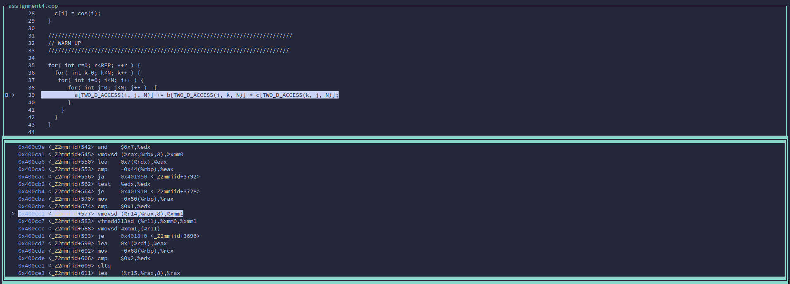

# Assignment 4 Report
Group: 104

## 1)
### a) After analyzing the data dependency, we can safely use the following permutations:
* jik (without any performance improvements)
* **ikj** (with significant improvements in MFLOPS $\approx$ 2-4 times)
* kji (with a drop in the performance)
* jki (with a drop in the performance)
* kij (with a drop in the performance)
* ijk (the default case)

REASON: For the performance increase in "ijk" permutation is observed due to cache locality. As the entries loaded from memory to cache also loads adjacent blocks from the memory.  In each innermost iteration, this cache locality helps with the MFLOPS because the rows of B are actually contiguously placed in the memory.


The code shown below breaks the computation because a particular thread with iterator k is overwriting the results with indices i and j. This can be prevented by making sure that at least one of i or j is split by using ```#pragma omp parallel for``` directive.
```cpp
#pragma omp parallel for schedule(static)
for( int k=0; k<N; k++ )  {
    for( int i=0; i<N; i++ )  {
        for( int j=0; j<N; j++ )  {
            a[TWO_D_ACCESS(i, j, N)] += b[TWO_D_ACCESS(i, k, N)]* c[TWO_D_ACCESS(k, j, N)];
        }
    }
}

```

### b)
We can also implement with nested parallelism as long as the directive ```#pragma omp parallel for``` is not above 'k'. The reason is same as previously mentioned.

The nested parallelism for the code snippet shown below also works, but the performance is not good as compared to single ```#pragma omp parallel for``` directive used for ikj permutation.
```cpp 
    for( int r=0; r<REP; ++r ) {
      #pragma omp parallel for schedule(static)
        for( int i=0; i<N; i++ )  {
          for( int k=0; k<N; k++ )  {
            #pragma omp parallel for schedule(static) // REMOVE *** Too Slow
            for( int j=0; j<N; j++ )  {
            a[TWO_D_ACCESS(i, j, N)] += b[TWO_D_ACCESS(i, k, N)] * c[TWO_D_ACCESS(k, j, N)];
          }
        }
      }
    }
```
The computational work in each iteration is similar, dividing the array into #Thread pieces will result in the best performance.

### 2)
#### a) Testing different combinations of CFlags


### Vector Width plots


#### b) Disassemble code
Using the -g compiler flag we are able to use gdb to see disassembled version of the code overlayed with the regular code using the ```layout split``` command and navigating over the code by using ```s``` or ```n``` and navigating the assembly code by using ```si``` and ```ni``` .  This can be seen in the following image:



* ice1: the provided image was on ice1 and you can see that it uses vector instructions (c++)
* thx2: didn't use any vector instructions (g++)
* milan2: objdump seemed to be a quicker way to find out if the system used vector instructions: 
  ```
  h039y25@milan2:~/Group-104/assignment4/src> objdump -d assignment4 | grep fmadd
  400c0a:       c4 c2 e9 a9 01          vfmadd213sd (%r9),%xmm2,%xmm0
  400c47:       c4 e2 f1 a8 04 01       vfmadd213pd (%rcx,%rax,1),%xmm1,%xmm0
  400c83:       c4 e2 e9 a9 02          vfmadd213sd (%rdx),%xmm2,%xmm0
  400ca4:       c4 c2 e1 99 14 f4       vfmadd132sd (%r12,%rsi,8),%xmm3,%xmm2
  400ded:       c4 c2 e9 a9 03          vfmadd213sd (%r11),%xmm2,%xmm0
  400e18:       c4 e2 f1 a8 04 01       vfmadd213pd (%rcx,%rax,1),%xmm1,%xmm0
  400e52:       c4 c2 e9 a9 07          vfmadd213sd (%r15),%xmm2,%xmm0
  400e73:       c4 c2 d9 99 14 c4       vfmadd132sd (%r12,%rax,8),%xmm4,%xmm2
  ```
* cs2: Doesn't use vector instructions
  ```
  [h039y25@cs2 src]$ objdump -d assignment4 | grep fmadd
    400c54:       1f420020        fmadd   d0, d1, d2, d0
    400d80:       1f470821        fmadd   d1, d1, d7, d2
    400d84:       1f4004c0        fmadd   d0, d6, d0, d1
    400db4:       1f4108e1        fmadd   d1, d7, d1, d2
    400db8:       1f4004c0        fmadd   d0, d6, d0, d1
    400de0:       1f4204e7        fmadd   d7, d7, d2, d1
    400de4:       1f401cc6        fmadd   d6, d6, d0, d7
    400e6c:       1f430400        fmadd   d0, d0, d3, d1
  ``` 

#### c) Permutations of "ijk" loops iterations


#### d) TILE_SIZING
The tiled version has been implemented and it has been adapted to work with N % TILE_SIZE !=  0.
```cpp
  for( int r=0; r<REP; ++r ) {
    for( int i=0; i<N; i+=TILE_SIZE ) {
      int i_end = std::min(i+TILE_SIZE, N); // last tile gets "chopped off"  
      for( int k=0; k<N; k+=TILE_SIZE ) {
        int k_end = std::min(k+TILE_SIZE, N); 
        for( int j=0; j<N; j+=TILE_SIZE ) {
          int j_end = std::min(j+TILE_SIZE, N); 
          for(int ii=i; ii<i_end; ++ii) {
            for(int kk=k; kk<k_end; ++kk) {
              for(int jj=j; jj<j_end; ++jj) {
                a[TWO_D_ACCESS(ii, jj, N)] += b[TWO_D_ACCESS(ii, kk, N)] * c[TWO_D_ACCESS(kk, jj, N)];
              }
            }
          }
        }
      }
    }
  }
``` 

Here is a visualization to show the tiling effect and why it might be useful.
* N = 8
* TILE_SIZE = 4


As you can see the tiles are worked row-wise. This will have an effect on cache locality as the cache might load closeby memory addresses that are likely to be accessed again later on.

To find out the most suitable tile-size per server, we ran the matrix multiplication for different tile-sizes.

**ice**:


**milan**:


**thx2**:


**cs2**:


#### e) Strong scaling 
For the strong scaling experiment we adjusted the number of threads used and plotted threads against MFLOPS.

**ice**:


**milan**:


**thx2**:


**cs2**:


As you can see, the performance immediately drops once the number of physical cores is exceeded.
This is quite unexpected as we almost always have the same number of vector units as threads. 

#### f) PEAK PERFORMANCE
TO calculate the peak performance of a platform, we use the following formula:

**Peak Performance = (#Sockets) X (Clock Rate) X (#Cores X #Threads per core) X (#Threads per core/ #Vector units per Core) X (#Vector Units) X (Flops per Vector Unit per Clock Cycle)**

### Intel Icelake
  Peak Performance = (2) X (2.4 X 10^9) X (36 X 2) X (2/2) X (8) X (2)
                   = 9.8 TFLOPS

### AMD Milan-X
  Peak Performance = (2) X (2.2 X 10^9) X (64 X 2) X (2/2) X (4) X (2)
                   = 9 TFLOPS

### Marvell ThunderX2
  Peak Performance = (2) X (2.2 X 10^9) X (32 X 4) X (4/1) X (2) X (2)A total list of what is checked on milan2:

    FLOPS_DP
    CACHE

                   = 9 TFLOPS

### Fujitsu A64FX
  Peak Performance = (4) X (1.8 X 10^9) X (12  X 1) X (2) X (1) X (2)
                   = 1.2 TFLOPS

#### g)
**Main Memory Bandwidth=(Memory Frequency) X (#Channels) X (#Bytes of Width)**

### Intel Icelake
Main Memory bandwidth = (3200) X (8) X (64)
                      = 204 GB/s

### AMD Milan-X
Main Memory Bandwidht = (3200) X (8) X (64)
                      = 204 GB/s

### Marvell ThunderX2
Main Memory Bandwidth = (2666) X (8) X (64)
                      = 170 GB/s
                      
#### h) 
To estimate the memory-bandwith (and see how close it is to the theoretical) we can run:
```
likwid-bench -t load_avx -W N:2GB:144
```
Which yielded a memory-bandwith on **ice1** of:
```
MByte/s:          349170.84      
```

For estimating the FLOP performance, they also provide another benchmark:
```
likwid-bench -t peakflops_avx_fma -W N:360kB:144
```
Which results in:
```
MFlops/s:               2891820.95
```
360kB makes sure that the vectors fit in L1-Cache.


We couldn't get the matrix multiplcation code working with likwid. At least not the multiprocessing. 
We get completely unexpected results when running the command with all CPUs. It might be a problem with core-pinning as htop showed only one cpu running and the others only briefly.

Here is the code snippet out of our run-script:
```sh
export OMP_NUM_THREADS=$THREAD OMP_PROC_BIND=${PROC_BIND} OMP_PLACES=cores
CORES="0-$(( $THREAD -1 ))"
likwid-perfctr -g ${GROUP} -C ${CORES} -m ./assignment4_omp_${HOSTNAME} ${TILE_SIZE} | tee ./results/ex02h/${filename}_threads_${THREAD}_${GROUP}.txt
```

E.g.: ice1, ```$THREAD=144``` so it should use the threads 0-143, but the code only seems to run on core 0.

For the Roofline model, we need operational intensity vs. MFLOP/s
For this we can use the following performance groups:

* MEM_DP: yields operational intensity
* FLOPS_DP: yields FLOPS/s

For ice1:
Operational intensity:  1.1791 FLOP/Byte
FLOP/s:                 6487.9085 FLOP/s    

Which results in the following roofline-model entry: 


As you can see, something has gone horibly wrong. 

#### i)

As we can't get LIKWID running on multiple cores, this experiment is conducted on a single CPU.

We will consider Cache-Hits and Misses and will probably see a decline when we start using the tiled version of the code.

A total list of what is checked on milan2:
* FLOPS_DP
* CACHE

| Loop | FLOPS/s | CACHE miss rate |
|------|-----------|---------|
|   default   |  2350.54         | 0.2011   |
|   best |     16086.56      | 0.1618    |
|   tiled   |   17062.10        |  0.0104     |
