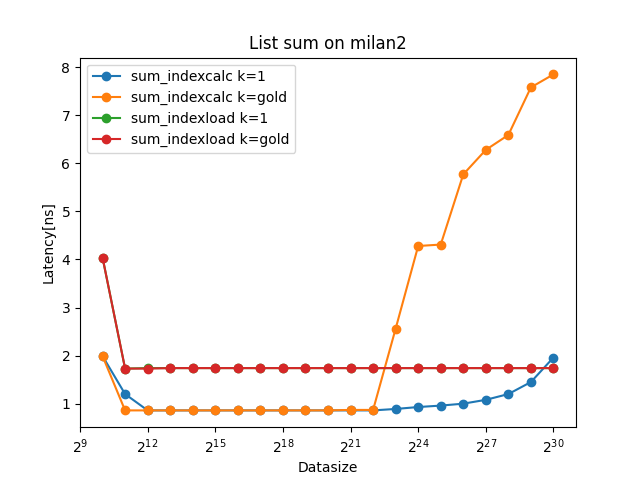

# Assignment 7 Report
Group: 104 

> Context: Raj was sick so I (Lukas) did all the work this time.

# 1) Linked List Traversal
## Exercise 1 a) Getting the code running.
To return the duration, I first calculate the duration using the given method:
```cpp
double duration = get_duration(t0, t1);
return duration / (double) (N * REP);
```

> small update: get_duration didn't return the duration in nano_seconds so I had to cast the results to nanoseconds using: ```std::chrono::duration_cast<std::chrono::nanoseconds>(t1 - t0).count();```

So the golden ratio should be close to k/N. So I have the following approximation:
$$
goldenRatio \approx \frac{k}{N}
$$

which can be rearranged like this:
$$
k \approx goldenRatio * N
$$

And to make sure that k and N are coprime I make sure that the $gcd(N, k) = 1$.

This can be implemented in cpp in the following way:

```cpp
k = goldenRatio * N;
while(std::gcd(N, k) != 1) k++;
```

Also the value is initialized with 0 and changed to 1 with when doing the summation. The result will therefore be the size of the array. This is also used as an assertion later on.

```cpp
void check_result(double result, int expected_result){
    if (result != (double) expected_result){
        printf("ERROR: %d != %d\n", result, expected_result);
        exit(1);
    }
}
//...
sum_indexcalc_time = sum_indexcalc(N, 1, cycles, &sum_calc, &dummy);
printf("| %20s | %12ld | %12.2f | %12ld | %12.1f |  \n", "sum_indexcalc k=1",N, sum_indexcalc_time, cycles, sum_calc);
check_result(sum_calc, N); 
```

To make sure that the code is running on a fixed core I used likwid-pin.

```bash
likwid-pin -c 3 ./list 1073741824 1073741824 
```

## Exercise 1 b)
Running the experiment with N=2^30 yielded the following results:


#### ice1:

Here you can see that for index_calc k=gold it seems to already struggle at around 2^12 but finally diverges as 2^21. I think that has something to do with caches.

Also for indexcalc k=1 the same effect seems to happen also but later! This might be explained by cache prefetching behavior. As the cache might prefetch adresses close to ones that are already loaded.

Also both "curves" for index_load are constant. This is what is to be expected, as prefetching is not really possible in this scenario. 

Finally: Index loading seems to be more robust for larger dataset sizes. Therefore at some point (i.e. some dataset size), it seems to be a better method altogether. Where this point is, will later be explored by cross-reference to cache-sizes.

#### milan2:


Here we see similar behavior to ice1, although for smaller sizes it seems to be slower. This might be an averaging effect we see here as the branch predictor is calibrating. So later branches will be hit but earlier ones aren't, this leads to earlier branches taking longer than later ones.

#### thx2:


Interestingly: Index load performs exactly the same to index calc here and for larger N it even outperforms it! It seems like there is some cache optimization already in place for this use-case!

#### cs2:
I wasn't able to gather information on this system as it was stuck running the code :(. 


> There seems to be some caching effect on index load as for all the systems it had really constant access times. thx2 seems to be the best optimized for this use-case. For the others systems we might see caching of only the next element.

## Exercise 1c)
For this I adapted the code to only measure the first access to the list. 

Here is the inner loop for index calc:
```cpp
        for (int64_t i = 0; i < N; ++i) {
            if (i == 0) {
                auto t0 = std::chrono::high_resolution_clock::now();
                A[next].v = 1.0;
                sum += A[next].v;
                dummy |= A[next].next;
                next = (k * (i + 1)) & mask;
                auto t1 = std::chrono::high_resolution_clock::now();
                t_res += std::chrono::duration_cast<std::chrono::nanoseconds>(t1 - t0).count(); 
            } else {
                A[next].v = 1.0;
                sum += A[next].v;
                dummy |= A[next].next;
                next = (k * (i + 1)) & mask;
            }
        }
```

The duration is then calculated by:
```cpp
return t_res / REP;
```
> It is important to actually run through the whole dataset to make sure that the cache is cleared after a run through! Therefore the if statement and not just a break after the first element.

> Choosing N is also important as the dataset shouldn't be able to fit into the caches in the first place. 

Because we expect the first element to be a cache miss we can assume that the value was fetched from main memory. As we load 8 bytes and we know how long it took to fetch it (neglecting computation time), we can estimate the bandwidth:

    x ns       ≙   8 bytes transfered
    1 s        ≙  (10^9 / x) * 8 bytes transfered
    1 s        ≙  8 / x  GB

    

### Results for only the access time (first element only):
Here I would say ```indexcalc``` seems to be the best indicator for this as the load times for ```indexload``` once again seem pretty constant.

#### ice1: 


Here the highest point is at a latency of 356.0 ns with k=1 and N=2^27.

#### milan2: 


Using k=1 with indexcalc again we get the max latency here at: 365.31 ns. 

#### thx2: 


Here the max latency is at 323.75 ns but using k=gold.

### Calculating the bandidth per system:

Bandwidth_ice = (8 / 356) GB/s = 0.22 GB/s 
Bandwidth_milan = (8 / 365.32) GB/s 
Bandwidth_thx2 = (8 / 323.75) GB/s

#### Exercise 1d) 
The memory access latency is the time where the memory access is issued to when it is actually availabe.

As the data was initialized using the same core, the data must reside in the NUMA domain of the core. Therefore, if N is large enough to fill all the caches and we use index calc instead of index load, we actually measure the latency to the NUMA domain. So the latencies in 1c) should apply. 

No memory parallelism would be the indexload setting, so I don't quite get what the hint is trying to tell me, because access times are stable regardless of N. 

It could be that with index_calc (especially with k=gold) we basically also run out of memory for the numa domain and I actually measure latency to the main memory and not the numa domain. 

Another assumption is that the second access to the first element also always hits L1. This shouldn't be the case for large enough N especially with the indexcalc variant. 


## Exercise 1e) 

### Data cache sizes:
#### Ice 1:
* L1d: 3.4 MiB -> can store math.floor((3.4 * 2^20)/8) doubles = 445644 doubles
* L2:  2.3 MiB -> 301465 doubles
* l3:  108 MiB -> 14155776 doubles
#### Milan2:
* L1d: 4.0 MiB -> 524288 doubles
* L2:  4.0 MiB -> 524288 doubles
* L3:  1.5 GiB -> 201326592 doubles

#### thx2:
* L1d: 32 KiB -> 4096 doubles
* L2:  256 KiB -> 32768 doubles
* L3:  32768 KiB -> 4194304 doubles

To create the table we can look up the access time on the already generated graph. Obviously I can't use the variations which yield constant access times, so I went with index_calc k = gold.

So painting in the thresholds this comes up:


The only one where the size of the cache somewhat correlates with the increase in latency is the thx2 one.

So my table is just the one for thx2:

l1-cache: 2.39 ns \
l2-cache: 2.39 ns \
l3-cache: 3.12 ns

This seems samewhat wrong. One might also assume that the latency steps are actually the accesses to the different caches.

