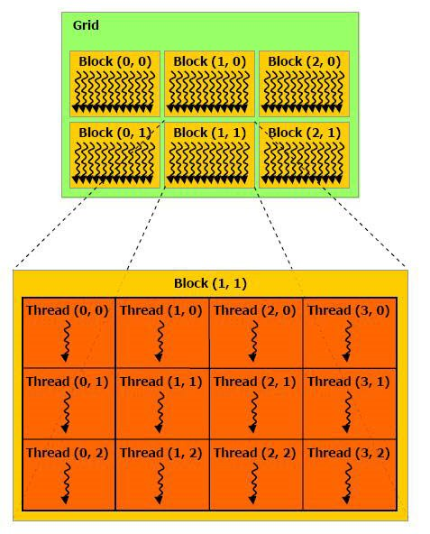
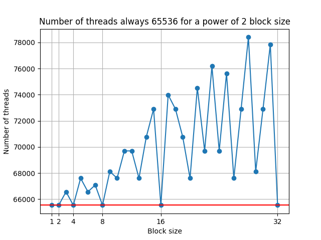
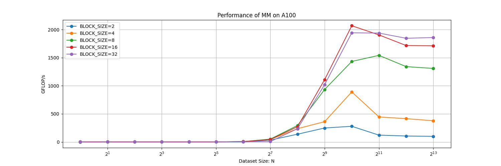
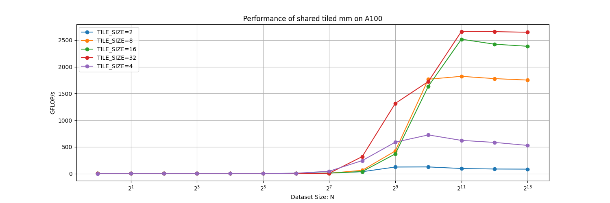
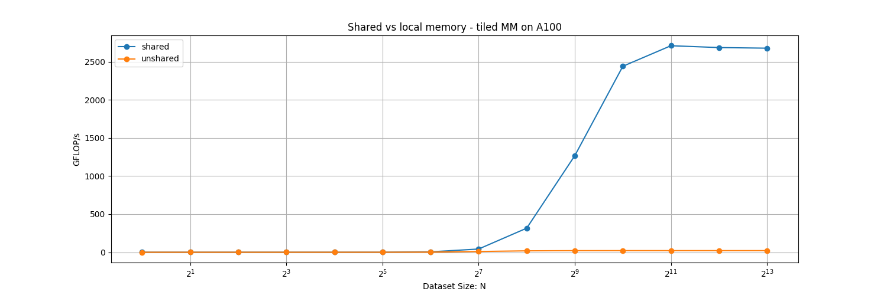
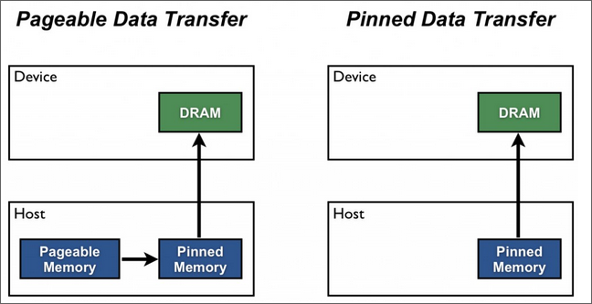
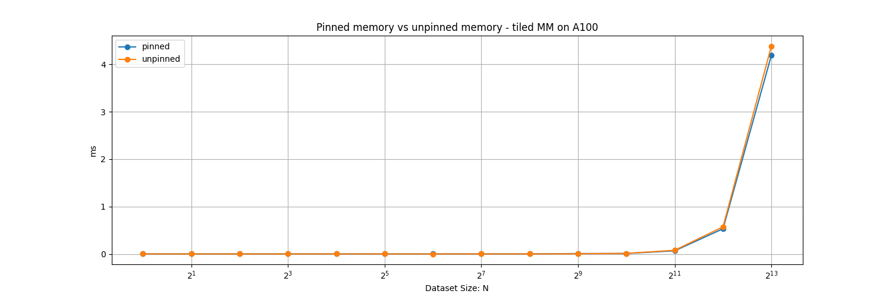

# Assignment 4 Report
Group: 104

## a) Query device properties:
> Use the CUDA code provided to query device properties. Inspect the API documentation to find out the most relevant data from structure cudaDeviceProp. If needed, adjust the number of blocks and threads according to the information found from device properties. Explain the reasoning. 

A quick overview of the thread-hierarchy in CUDA:


First we span a grid of blocks. Each block then contains a number of threads. 

In this code, the number of blocks in the grid is given by the ```dimGrid``` parameter. It is given by:

```cpp
    unsigned int grid_rows = (N + BLOCK_SIZE - 1) / BLOCK_SIZE;
    unsigned int grid_cols = (N + BLOCK_SIZE - 1) / BLOCK_SIZE;
    dim3 dimGrid(grid_cols, grid_rows);
    dim3 dimBlock(BLOCK_SIZE, BLOCK_SIZE);  
```

With a ```BLOCK_SIZE``` of 32 and N = 256 this yields a ```dimGrid```
of (8.97, 8.97) which will be rounded down to (8, 8). 

Number of Blocks: 64
Total Number of Threads: 64 * 32 * 32 = 65536

This formula above always adjusts the number of threads to be exactly 65536, by changing the grid dimensions. This is only true for powers of 2.

This can be seen here:


According to the [CUDA-Programming Guide](https://docs.nvidia.com/cuda/cuda-c-programming-guide/index.html#dim3) ```dim3``` is a vector of ```uint3```.
So 32 seems to be the highest number we can use for BLOCK_SIZE.

Using the deviceProp ```maxThreadsPerBlock``` we can see that 32 * 32 = **1024** is the maximum number of threads per block on the A100.

The GPU has multiple streaming multi processors (SMP), and we can also check the maximum number of block per SMP by using the deviceProp ```maxBlocksPerMultiProcessor```: 32

The last thing we check is the number of available SMPs by using the deviceProp ```multiProcessorCount```: 108.

Now we can calculate the max number of threads per SMP: 1024 * 32 = **32768**. So by now we fill 2 SMP with N=256.

Therefore the number of total threads per GPU is 1024 * 32 * 108 = **3.538.944**. 

From what we have seen, 32 seems to be a good ```BLOCK_SIZE``` as it completly fills a block. Using numbers that aren't a power of 2 didn't work for the tiling implementation.

## b) Global Memory Matrix Multiplication
>  Check and understand the implementation of
matrix multiplication by using the allocated global memories. Make necessary adjustments to measure the FLOP rates and memory bandwidth utilization of your code on GPU, similar to previous assignments.

To do this we will change the dataset size while running and also try and use the LIKWID marker api for nvidia-gpus to figure out the FLOP rate and bandwidth.

Apparently likwid wasn't compiled with NVIDIA_INTERFACE=true as 
```likwid_perfctr -a``` didn't show any GPU realated performance groups. Therefore I wasn't able to use LIKWID.

In earlier assignments, we mostly plotted FLOP rate vs dataset size so this is what I will also do here.
For this, I disabled the cpu_checksum as this would take too long for larger sizes of N.

This yielded the following graph:



<!-- TODO add bandwidth -->

## c) Tiled implementation

```cpp
__global__ void sharedTiledMM(double* a, double* b, double* c,
		int N, int REP) {
	__shared__ double aTile[TILE_DIM][TILE_DIM];
	__shared__ double bTile[TILE_DIM][TILE_DIM];
	int row = blockIdx.y* blockDim.y+ threadIdx.y; 
	int col= blockIdx.x* blockDim.x+ threadIdx.x; 
	double sum = 0; 
	
	for(int j = 0 ; j<REP ; ++j){
		for (int k = 0; k < N; k += TILE_DIM) { 
			aTile[threadIdx.y][threadIdx.x] = a[ (row * N) + k + threadIdx.x]; 
			bTile[threadIdx.y][threadIdx.x] = b[(threadIdx.y + k)*N + col]; 
			__syncthreads(); 
			for (int i = 0; i < TILE_DIM; i++) 
				sum += aTile[threadIdx.y][i]* bTile[i][threadIdx.x];
			__syncthreads();
		} 
		c[row*N +col] = sum; 
	}
}
```

Interestingly enough: The tile size seems to be coupled to the block size. As changing the tile size to anything else than the block size results in a 0 as a result. It most likely has to do with some race conditions where multiple threads access the same memory in ```d_c``` and overwrite the result.

The results can be seen here:


Hence tile size 32 seems to be the best. The following experiments will be measured with tilesize 32 and blocksize 32.


## d) Shared Memory:
> In your tiled implementation and carry over the tile data to shared mem-
ory. Your tiles can be carried over to shared memory by using share attribute as in 1. Measure FLOP rates and memory bandwidth utilization. Report the observed improvements and explain the reason.

This obviously refers to these lines:
```cpp
	__shared__ double aTile[TILE_DIM][TILE_DIM];
	__shared__ double bTile[TILE_DIM][TILE_DIM];
```

This allocates space on the shared memory which is memory that is shared between threads in a block. Shared memory is faster than uncached global memory and faster than local memory (memory region for spilled over registers). 

Here are the results:


Here the difference is clearly visble. The highest MFLOP/s for **unshared memory** was: 21091 MFLOP/s
And the fastes for **shared memory** was: 2680870 MFLOP/s.
Speed-up factor was therefore $\approx$ **127**.

## e) Host-Device Memory transfer optimisations:
> To optimise memory transfers between
CPU and GPU CUDA provides zero-copy memory which is a component of CUDA’s Unified Virtual Adressing system. Zero copy memory allocations require data to be allocated on the pinned (unpagable) segment of the CPU and the transfer of such allocations to GPU require one copy less than the transfer of the normal device memory allocations. To optimise the memory transfer time between CPU and GPU find the necessary CUDA API call in the documentation and change the memory allocation and transfer calls accordingly. (Hint: https://developer.nvidia.com/blog/how-optimize-data-transfers-cuda-cc/). Once the transfers are optimised compare the total execution time of the application for different dataset sizes to measure effect of zero copy memory.

For this we want to first pin our memory.
In the [article](https://developer.nvidia.com/blog/how-optimize-data-transfers-cuda-cc/) we see this beautiful picture, explaining what is happening:



Here we see that we loose one memory transfer from pagable memory to pinned memory! This should improve our runtime.

Also this code seems relevant:
```cpp
// host arrays
float *h_aPageable, *h_bPageable;   
float *h_aPinned, *h_bPinned;

// device array
float *d_a;

// allocate and initialize
h_aPageable = (float*)malloc(bytes);                    // host pageable
h_bPageable = (float*)malloc(bytes);                    // host pageable
checkCuda( cudaMallocHost((void**)&h_aPinned, bytes) ); // host pinned
checkCuda( cudaMallocHost((void**)&h_bPinned, bytes) ); // host pinned
checkCuda( cudaMalloc((void**)&d_a, bytes) );           // device
```

This will be adapted in the code like this:

```cpp
double *a, *b, *c;
cudaMallocHost((void**)&a, sizeof(double)*N*N);
cudaMallocHost((void**)&b, sizeof(double)*N*N);
cudaMallocHost((void**)&c, sizeof(double)*N*N);
```

Then we also have to free them like this:
```cpp
cudaFree(a);
cudaFree(b);
cudaFreeHost(c);
cudaFree(d_a);
cudaFree(d_b);
cudaFree(d_c);
```

We now also just report the time back and measure the whole time it took to copy it over to the device and back.

Both seem to yield a very similar result:


## f) Hipify
> Hipify your code (assignment8.cu and cudautil.h ) on milan2 node by hipify-perl <input-file> -o=<output-file> . Check if your code is properly hipified and make necessary corrections. Report the parts of code that were not translatedby hipify tool.

Obviously there was some foreshadowing happening here:
```cpp
// Task f: Some PTX code :) What is PTX ? Why is this here ? Why will this cause problems ? :) 
__device__ __forceinline__ unsigned long long __globaltimer() {
	unsigned long long globaltimer;
	asm volatile ("mov.u64 %0, %globaltimer;"   : "=l"(globaltimer));
	return globaltimer;
}
```

Aaaand it did cause problems....
```bash
In file included from assignment8_hip.cu:9:
./cudautil_hip.h:32:48: error: invalid output constraint '=l' in asm
        asm volatile ("mov.u64 %0, %globaltimer;"   : "=l"(globaltimer));
```

Apparently this is some code that is to be executed on each thread and uses some inline assembler for cuda threadsd. Also the globaltimer just doesn't seem to be available in HIP.

Also it doesn't like maxBlockPerMultiProcessor:
```bash
./cudautil_hip.h:139:88: error: no member named 'maxBlocksPerMultiProcessor' in 'hipDeviceProp_t'; did you mean 'maxThreadsPerMultiProcessor'?
        std::cout << left<<setw(32)<< "Max Blocks per MP:"<<                    left<< setw(40)<< deviceProp.maxBlocksPerMultiProcessor <<std::endl;
```
Commenting both didnt seem to work sadly as it resulted in a segfault. 